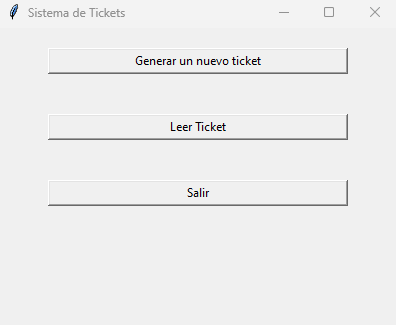
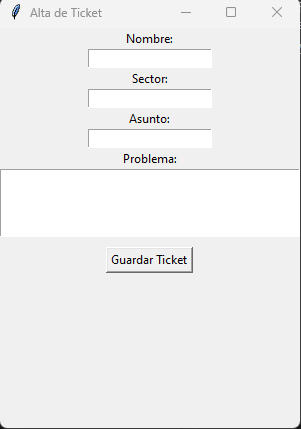
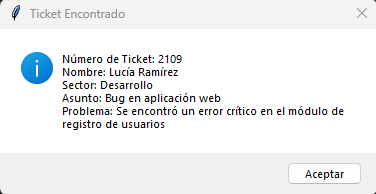

# Proyecto Final de Sistemas

## Integrante
- Melina Figueroa

## Descripción General
Este proyecto consta de dos módulos principales:
1. Sistema de Gestión de Tickets
2. Conversor de Temperaturas

### 1. Sistema de Gestión de Tickets

#### Descripción
Aplicación de gestión de tickets que permite:
- Crear nuevos tickets
- Leer tickets existentes
- Almacenar tickets en un archivo CSV
- Interfaz gráfica intuitiva

#### Características
- Generación automática de número de ticket
- Almacenamiento persistente
- Interfaz gráfica con Tkinter
- Validación de campos

#### Requisitos
- Python 3.x
- Tkinter (incluido en instalación estándar de Python)

#### Instalación
```bash
# Clonar repositorio
git clone [URL del repositorio]

# Cambiar al directorio del proyecto
cd proyecto-sistemas
```

#### Estructura de Archivos
```
proyecto-sistemas/
│
├── sistema_tickets.py       # Script principal de tickets
├── tickets.csv              # Archivo de almacenamiento de tickets
└── README.md                # Documentación del proyecto
```

#### Uso
```bash
# Ejecutar la aplicación de tickets
python sistema_tickets.py
```

#### Capturas de Pantalla






#### Funcionalidades
- [x] Alta de tickets
- [x] Lectura de tickets
- [x] Almacenamiento en CSV
- [ ] Exportación de tickets (funcionalidad futura)

### 2. Conversor de Temperaturas

#### Descripción
Aplicación de conversión de temperaturas con:
- Conversión manual entre Celsius y Fahrenheit
- Interfaz gráfica desarrollada con Tkinter

#### Características
- Conversión directa entre escalas
- Interfaz simple e intuitiva
- Validación de entradas

#### Requisitos
- Python 3.x
- Tkinter (incluido en instalación estándar de Python)

#### Instalación
```bash
# Clonar repositorio
git clone [URL del repositorio]

# Cambiar al directorio del proyecto
cd conversor-temperaturas
```

#### Estructura de Archivos
```
conversor-temperaturas/
│
├── conversor_temperaturas.py  # Script principal 
└── README.md                  # Documentación del proyecto
```

#### Uso
```bash
# Ejecutar la aplicación de conversión
python conversor_temperaturas.py
```

#### Capturas de Pantalla
[Insertar capturas de pantalla de la aplicación]

#### Funcionalidades
- [x] Conversión de Celsius a Fahrenheit
- [x] Interfaz gráfica
- [ ] Conversión inversa (Fahrenheit a Celsius)
- [ ] Soporte para más escalas de temperatura

## Instrucciones de Ejecución

### Requisitos Previos
- Python 3.7 o superior
- pip (gestor de paquetes de Python)

### Pasos de Instalación
1. Clonar el repositorio
2. (Opcional) Crear entorno virtual
3. Instalar dependencias

```bash
# Crear entorno virtual
python -m venv venv

# Activar entorno virtual
# En Windows
venv\Scripts\activate
# En macOS/Linux
source venv/bin/activate

# Instalar dependencias
pip install tkinter
```

## Contribuciones
Las contribuciones son bienvenidas. Por favor, sigue estos pasos:
1. Hacer fork del repositorio
2. Crear rama de características
3. Commit de cambios
4. Push a la rama
5. Abrir un Pull Request

## Licencia
Este proyecto está licenciado bajo la Licencia MIT. Consulta el archivo [LICENSE](./LICENSE) para más detalles.

## Contacto
Autora: Melina Figueroa
```